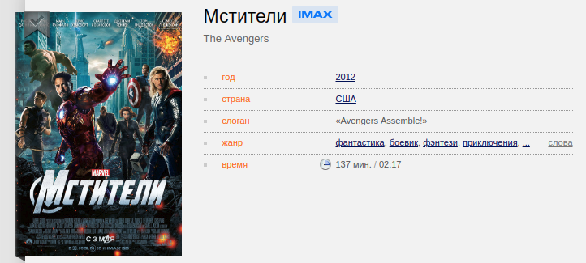

# Домашнее задание №1 к лекции «TypeScript»

## Новые типы

### Описание

На лекции мы написали классы для книг и аудио-альбомов. Но этого недостаточно, т.к. владельцы портала решили добавить возможность поддержки продажи фильмов.

Реализуйте класс `Movie`, который позволяет отобразить информацию, указанную на скриншоте (скриншот с сайта КиноПоиск):

Удостоверьтесь, что добавление объектов вашего класса в корзину работает.
